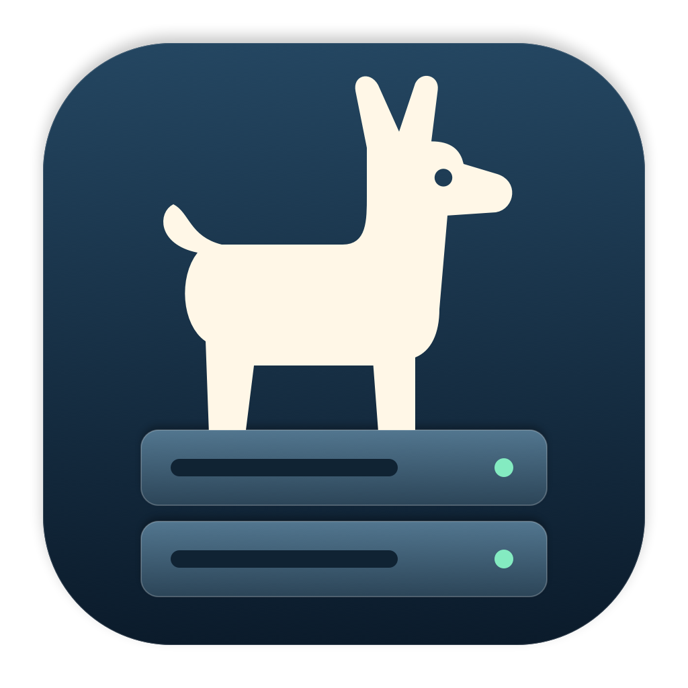

<p align="center"></p>

# LlamaPerch 🦙

**Your local models, perched in the menu bar.**

Start your llama.cpp server, switch GGUF models, peek at logs, and copy your API address—without juggling terminal windows.

## Get your llama running

1. [Download the latest release](https://github.com/ThatOneGuyGreggers/LlamaPerch/releases/tag/v0.0.4) and unzip **LlamaPerch.app**.
2. Open **Settings…**, choose your installed `llama-server`, and add a local GGUF in **Models**.
3. Save, hit **Start Server**, and wait for **Running**. You're ready to connect your favorite client.

**Intel Mac · macOS 13+ · CPU inference · One server at a time**

Bring your own [llama.cpp](https://github.com/ggml-org/llama.cpp) executable and model. These are development builds, ad-hoc signed and not notarized yet.

## Tinker time

With full Xcode installed:

```sh
./Scripts/build.sh
open build/LlamaPerch.app
```

[Setup & troubleshooting](docs/SETUP.md) · [Changelog](CHANGELOG.md) · [Wiki](https://github.com/ThatOneGuyGreggers/LlamaPerch/wiki) · [Build plan](PLAN.md)

---

**Development disclosure:** This project was generated using ChatGPT 6.1 Sol in Visual Studio Code using the Codex Plugin.
